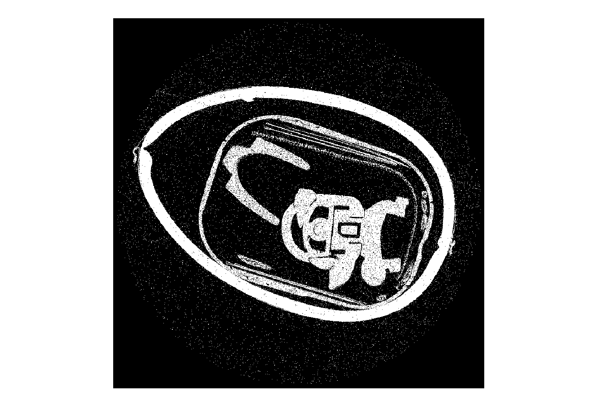
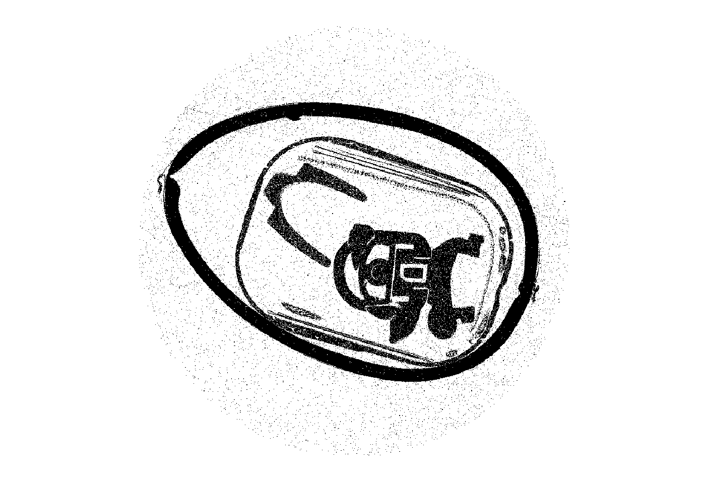

## Description

The Segmentation filter transforms a volume data set into a segmented volume data set.
This filter uses the thresholding method for the segmentation.

>'The simplest thresholding methods replace each pixel in an image with a black pixel if the image intensity I_i,j is less than some fixed constant T (that is, I_i , j < T ), or a white pixel if the image intensity is greater than that constant.'  [Thresholding on Wiki](<https://en.wikipedia.org/wiki/Thresholding_(image_processing)>)


For experienced users the thresholding can be performed with a set value. Alternatively the segmentation can be generated automaticly with the otsu-based thresholding.

### Manual thresholding

The manual thresholding requires a constant value as input from the user for the threshold.


### Otsu-based thresholding
By contrast to the manual thresholding the otsu-method generates an automatic value for the threshold.

>'In the simplest form, the algorithm returns a single intensity threshold that separate pixels into two classes, foreground and background. This threshold is determined by minimizing intra-class intensity variance, or equivalently, by maximizing inter-class variance.' [Otu's Method on Wiki](https://en.wikipedia.org/wiki/Otsu's_Method) 


### Negate Output
The negate-output function inverts the calculation of the data,  resulting into a negated output.

Source Code:

```outputBuffer.array[:] = (threshold > inputArray[:]) if negateOutput else (threshold <= inputArray[:])```

An example is shown below. On the left side a normal segmentated suprise egg with the otsu method and on the right side the same setup with the negated output function.

 


