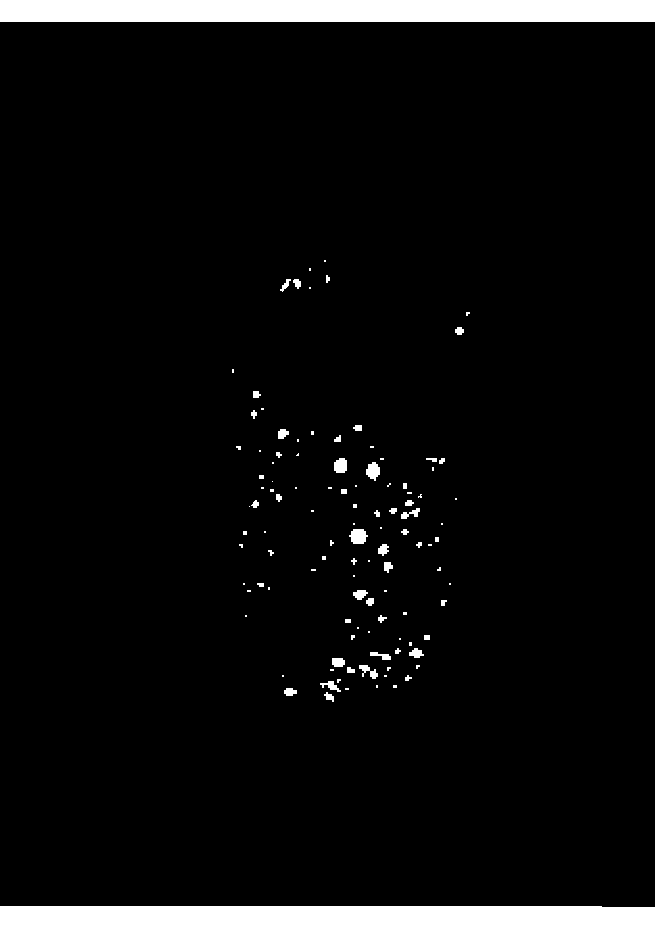
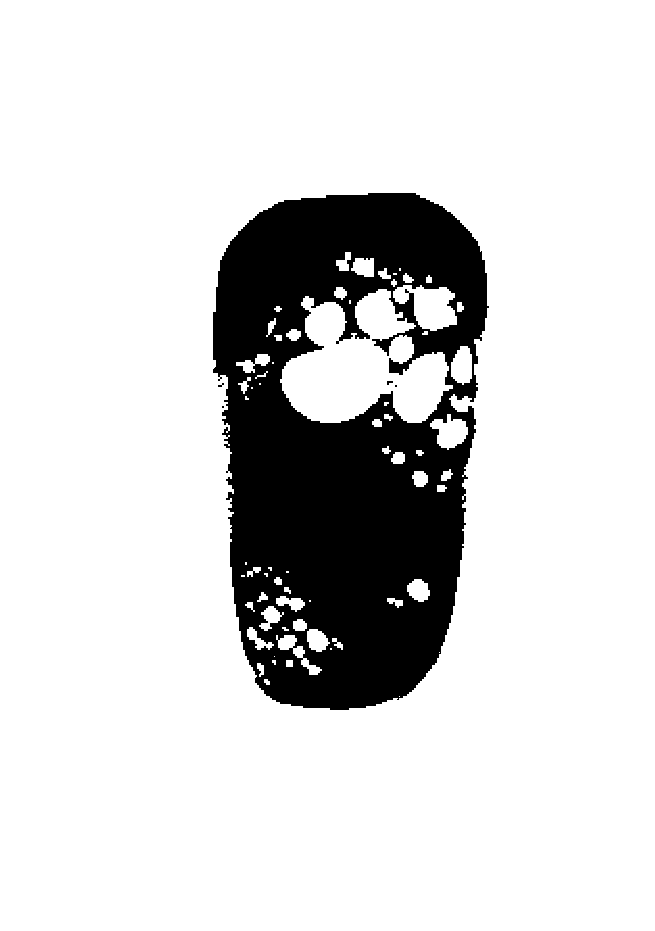
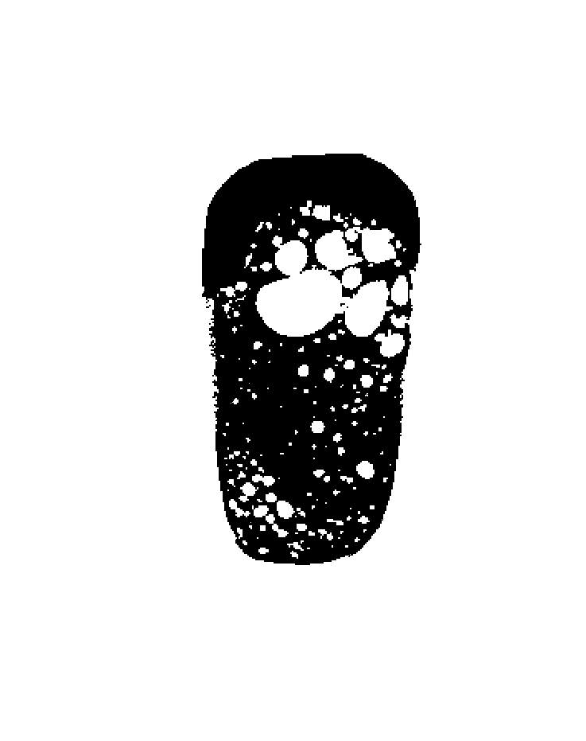

## Description

Pores can be separated into three categories, "Through Pores", "Closed Pores" and "Blind Pores".

"Through Pores" connect one side of an object to the other side, through which flow can occur.

"Closed Pores" are completely closed Pores within an object, which cannot be accessed from the outside.

"Blind Pores" are accessible from one side, but don't go through the whole object to the other side.

This filter removes or extracts all blind pores that are not connected to the edges of the image.

[Blind Pore Explained](https://www.filtnews.com/pore-size-characterization-filtration-materials/)

The picture on the left shows the object after use of the blind pore extractor. The picture on the right shows the object after use of the blind pore removal.

 

Object shown only with segmentation used.

## Parameters

The following list details which parameters are used by the filter.

### Mode

- Blind Pore Extractor
- Blind Pore Removal

Extrator is the selected Default Mode. Blind Pore Extractor shows all Blind Pores, while Blind Pore Removal removes them.
