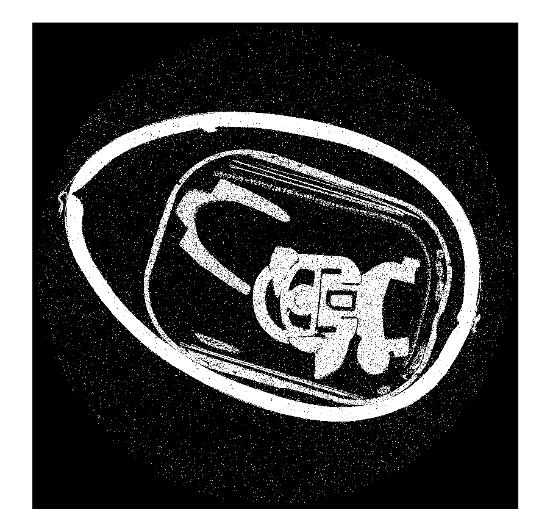
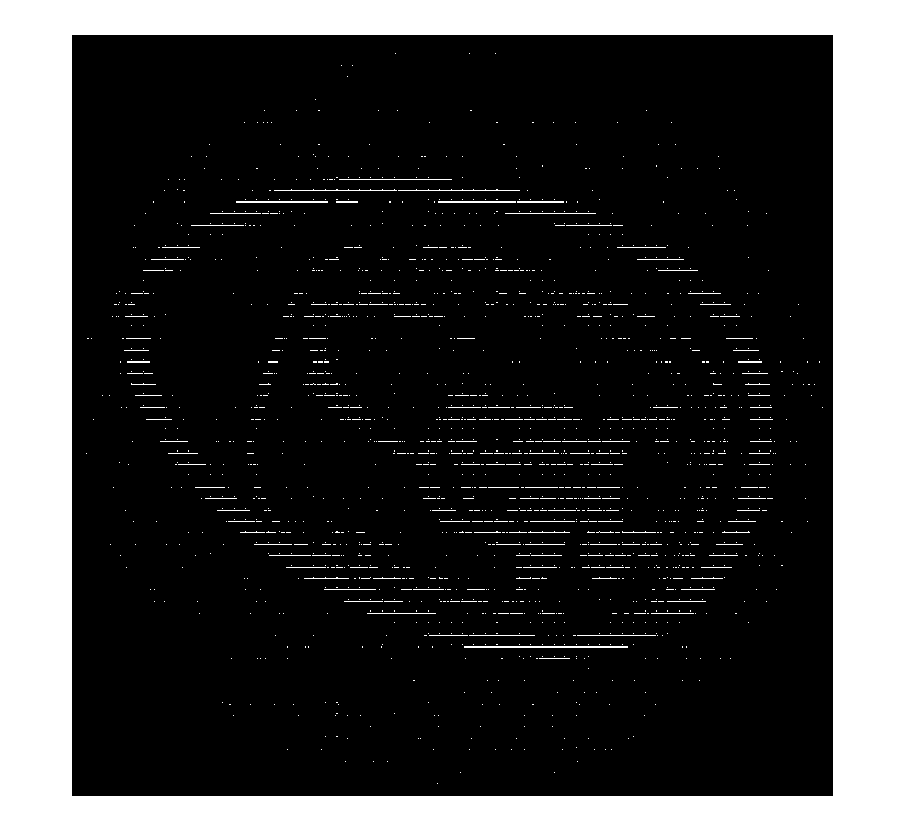

## Description

The Chord-Transform Filter takes a segmentation volume data and adds chords to the void space in the specified direction.

A suprise egg before and after the Chord-Transform was applied.

 

## Paramerers

The following list details which parameters can be modified for the Chord-Transform filter.

### Spacing Size

Each chord is separated by a number of voxels, depending on the spacing size.

The same suprise egg from above with a spacing size of 4 instead of 1.

### Axis

The user can select the axes with a simple button checklist. The chords for each axis are labeled with 1 for X-Dimension, 2 for Y-Dimension and 3 for the Z-Dimension. Chords will be applied only to the selected axes.

