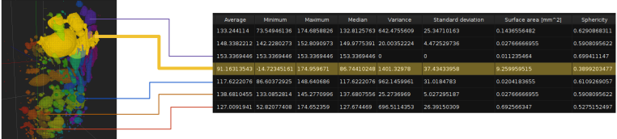

## Description

The Connected Component Analysis filter analyzes a volume consisting of labels, with the option of adding the original volume dataset prior to being segmented and labeled.
The filter outputs a table containing various metrics for each label occurring in the dataset.

The "Label" dataset is a mandatory input, the "Volume" input can be omitted (which removes certain columns from the table).
If both volume inputs are specified, their dimensions must match exactly.

## Metrics

The following list details which attributes are collected by the filter.

### Label ID
The unique integer index of the region within the labeled dataset.

### Voxel count
The total number of voxels in the region.

### Bounding box
The extent of the axis-aligned bounding box fully enclosing the region.

### Center of mass
The position of the region's unweighted center of mass.

Determined by summing up each voxel's coordinate vector and dividing the resulting vector by the voxel count.

### Weighted center of mass
The center of mass of the region, weighted by the absorption values. **Only available if the "Volume" dataset is given.**

Determined by summing up the product of each voxel's coordinate vector with its brightness value in the original volume, then dividing the result by the sum of all brightness values in the region.

### Sum of values
The total sum of all voxels' values within the region. **Only available if the "Volume" dataset is given.**

### Average
The mean of all voxels' values within the region. **Only available if the "Volume" dataset is given.**

### Inscribed sphere radius
The radius of the largest sphere that can fit into the region.

This is determined by finding the maximum value within the distance transform of the region.

### Surface area
An approximation of the surface area of the region in square voxels.

This is determined by performing the Marching Cubes algorithm on the segmented region and summing up the area of each produced triangle.

### Sphericity
An approximation of the sphericity of the region: a highly spherical region results in a sphericity value close to 1, while a deformed/elongated region yields a lower sphericity. 

This is determined by dividing the surface area of a sphere with the same volume (by voxel count) as the region by the approximated surface area of the region.

### Edge distance
The closest distance between any voxel in the region and the edge of the volume dataset.
Regions with an edge distance of zero are touching the edge of the volume.

Determined by taking the minimum along each axis of the differences between the start/end of the region's bounding box and the edges of the volume dataset.
