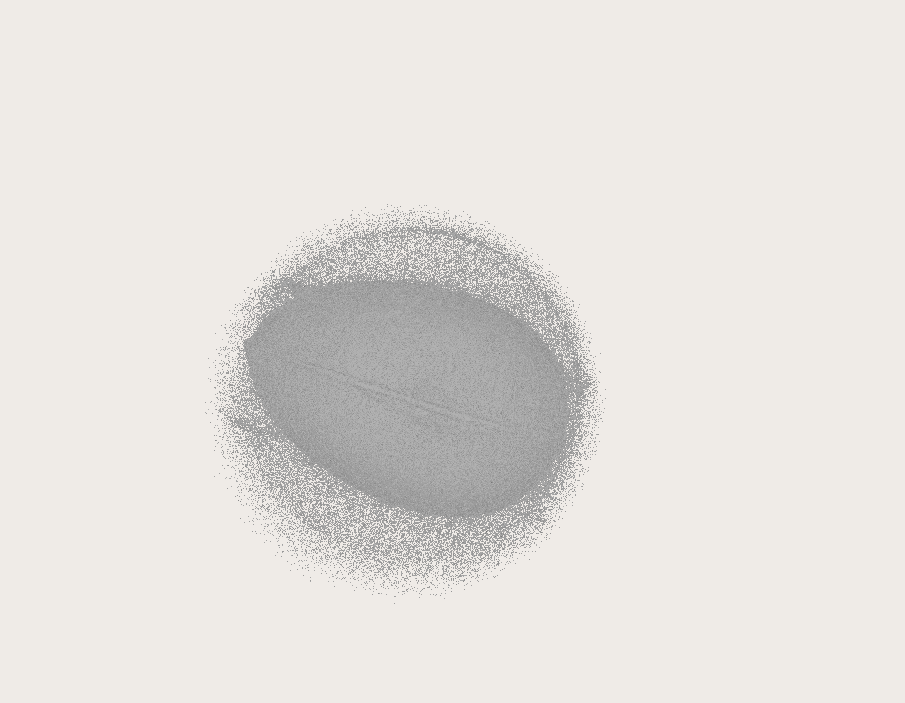
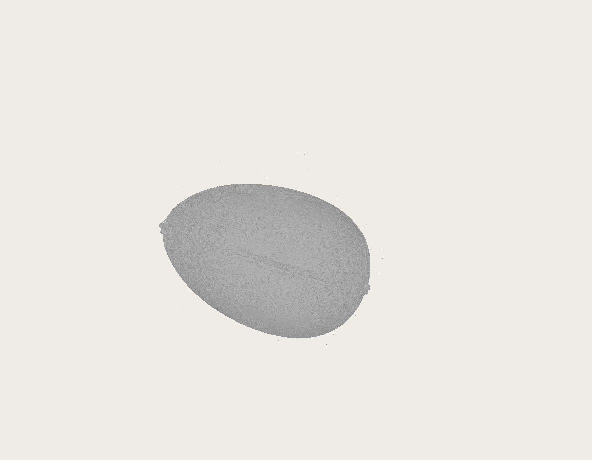
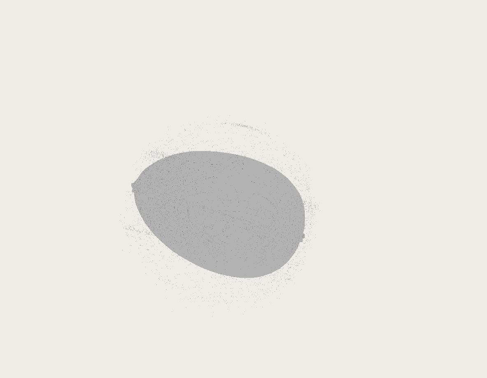

## Description

The createSurface filter expects a volume input and creates a surface, depending on the threshold value. This filter got two diffrent methods for extracting the suface: Marching Cubes and Cuberille.

### Threshold
The threshold value controls which areas of the model are interpreted as solid and which as transparent. Its the only user input required, besides the method used. An example with two diffrent values is shown below.

 

The left image was created with a value of 10 for the threshold, while the right had the value 20.
A higher value for the threshold can reduces noise effects, because the low areas, below the threshold, will be interpreted as transparent.

## Marching Cubes

Marching cubes is a computer graphics algorithm for extracting a polygonal mesh of an isosurface from a three-dimensional discrete scalar field (sometimes called a voxel). 

Algorithm

>1.The algorithm proceeds through the scalar field, taking eight neighbor locations at a time (thus forming an imaginary cube), then determining the polygon(s) needed to represent the part of the isosurface that passes through this cube. The individual polygons are then fused into the desired surface.  

>2.This is done by creating an index to a precalculated array of 256 possible polygon configurations  within the cube, by treating each of the 8 scalar values as a bit in an 8-bit integer. If the scalar's value is higher than the iso-value (i.e., it is inside the surface) then the appropriate bit is set to one, while if it is lower (outside), it is set to zero. The final value,  after all eight scalars are checked, is the actual index to the polygon indices array.  

>3.Finally each vertex of the generated polygons is placed on the appropriate position along the cube's edge by linearly interpolating the two scalar values that are connected by that edge.  

[Marching Cubes on Wikipedia](https://en.wikipedia.org/wiki/Marching_cubes)

## Cuberille

Axis aline subdivision, of space viewed, as splitting in-atomic polyhedral volume elements.
Cuberille should have a faster performance,than Marching Cubes, at the expense of quality.

 

Example of Cuberille (left) and Marching Cubes (right). Both images were created with a threshold value of 20.
