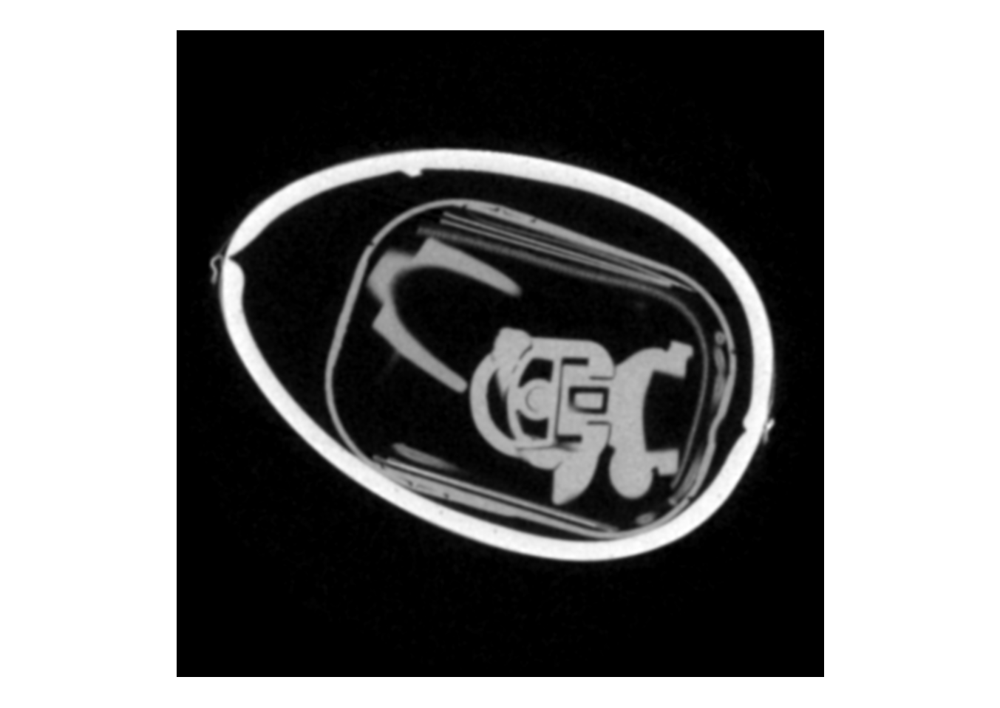

## Description

The Gaussian Filter uses the predefined function from scipy.ndimage to "blur" the input and remove detail and noise. 
An example is shown below.

A Surprise egg with(left) and without(right) the Gaussian-Filter. Sigma is set to 2 on the left.

  

## Parameters

The following list details which prameters are used by the filter.

### Sigma
The Gaussian-Filter has two changeable parameters, namely sigma and truncate.
Sigma is the standard deviation for Gaussian kernel. For higher values of sigma the "blur" effect of the gaussian filter occurs more strongly.
Truncate: Truncate the filter at this many standard deviations, default value is 4.

The same Surprise egg from above with a higher value for sigma (10 instead of 2)

 

