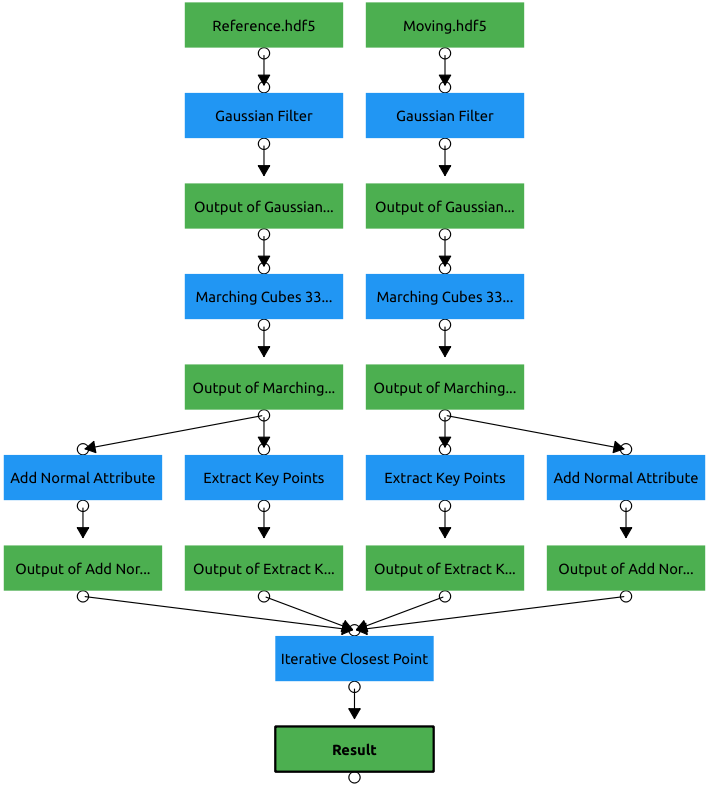

## Description

ICP aligns two surfaces but converges to a local optimum.
The full pipeline using Voxel data and feature matching is shown below.

The gaussian filter is optional but it should be used for noisy data.
The keypoint inputs of the ICP filter are only needed when PFH or FPFH is chosen.
FPFH and PFH circumvent the local optimum but calculating and matching feature points is expensive.
For large surfaces it is recommended to calculate the result on a downsampled data set.
The "Position Properties" of the downsampled result can be used on the full size data as described in "Initial Guess Method - Input Property".

## Number of sample points

Both surfaces are sampled using normal-space sampling.
Increasing the number of samples increases the runtime especially when used with feature matching.

## Feature Support Radius

The neighborhood radius to calculate the feature descriptor for each keypoint.
If Feature Support Radius is set to zero it will be calculated automatically.

## Initial Guess Method

There are different initial guess implementations.

### None

None, starts direclty with the ICP algorithm. In some cases the initial position might be good enough.

### Center of Mass

Aligns the center of mass.

### PFH

Descriptor [Point Feature Histogram](https://pcl.readthedocs.io/projects/tutorials/en/latest/pfh_estimation.html#pfh-estimation) is used to match keypoints.
The initial guess will be determined by a RANSAC algorithm.
The inputs "Input KeyPoints" and "Reference KeyPoints" are required.

### FPFH

Descriptor [Fast Point Feature Histogram](https://pcl.readthedocs.io/projects/tutorials/en/latest/fpfh_estimation.html) is used to match keypoints.
The initial guess will be determined by a RANSAC algorithm.
The inputs "Input KeyPoints" and "Reference KeyPoints" are required.

### Input Property

A user defined initial guess. If this option is used, the "Position Properties" of the input "Input Points" will be used as initial guess.
