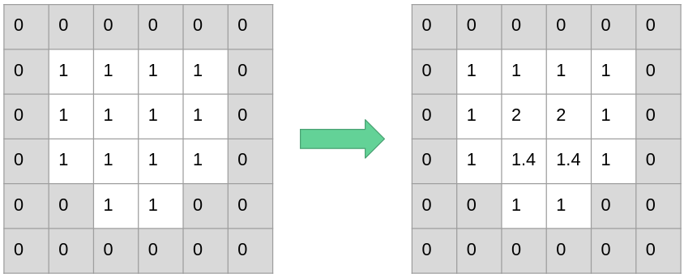
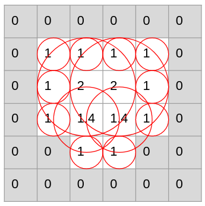
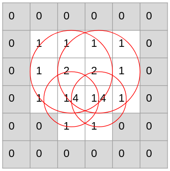
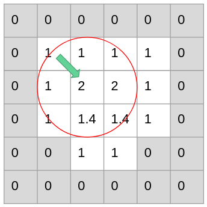
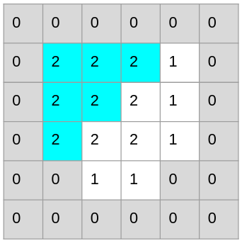
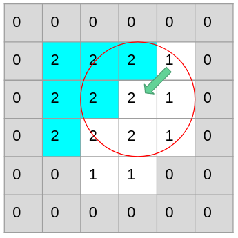
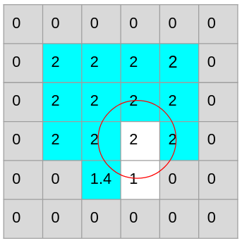

## Description

The diameter of the largest sphere that fits inside the object and contains the point p.

### Local Thickness Computation

- Perform the distance transformation to produce the distance map. It finds the radius of the largest sphere centered at q that fits inside the object.
- Remove redundant points to produce the distance ridge
- Compute the local thickness at each point p by scanning the distance ridge to find the largest q that owns p

[Local Thickness Explained](https://imagej.net/Local_Thickness)

## Properties

- Inherently 3D
- Does not depend on structural assumptions
- Expected results for plates, cylinders, cubes
- Suited to 3D imaging data
- Thickness distributions: mean, variance

## Computation

First the distance transform is applied to a binary image.

Naive and Heuristic are used for this filter operation and can be selected, Naive is selected as the default calculation.
Naive implementation loops over each point and calculates for each point the local thickness inside the points sphere.
This results in unnecessary computation if small spheres completly lie inside large spheres.

Each circle represents the local thickness calculations of a point in the outer loop.

Heuristic avoids this by ignoring redundant points.

First it searches for the local maximum.

Then it calculates the local thickness and marks redundant points.

This is repeated with the next unmarked point until finish.

This algorithm uses an approximation to check whether an point lies inside a sphere.
