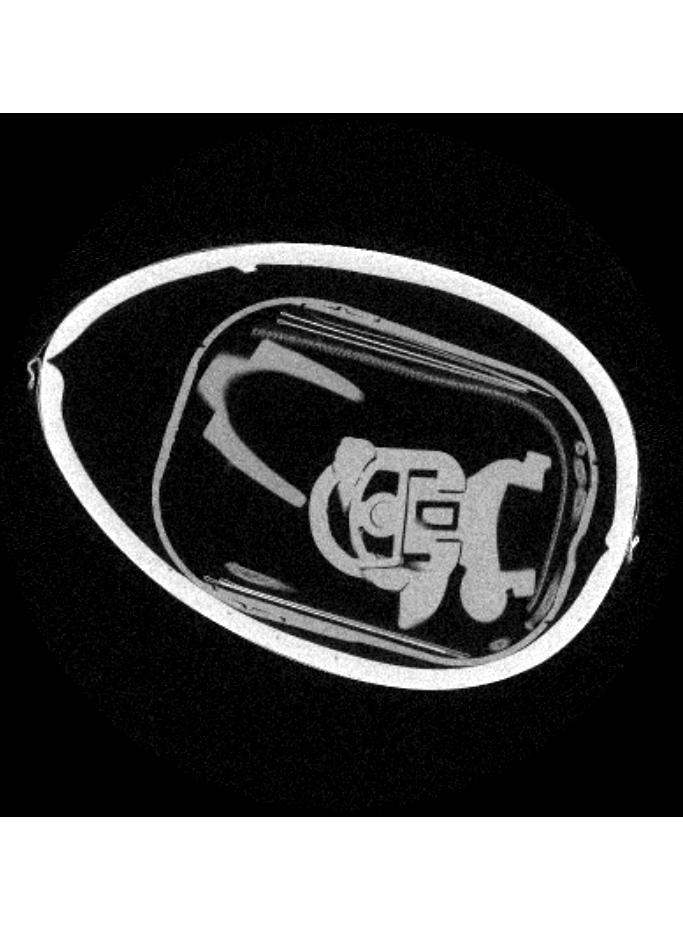
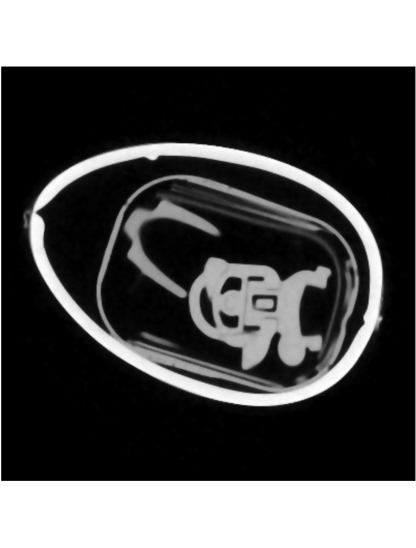
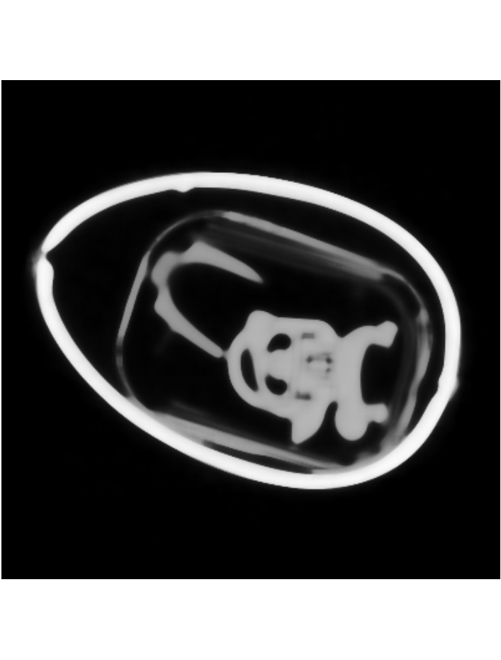

## Description

The Median Filter is used to reduce noise in an image, it preserves useful detail in the image.

Such noise reduction is a typical pre-processing step to improve the results of later processing.
Each pixel in the image is considered and every nearby neighbor looked at. 
The pixel value is then replaced with the median of all surrounding neighbors. 
The surrounding neighbors are sorted after their size and then the pixel value in the middle picked for the currently selected pixel. 
If the number of neighbors is even, the average of the two pixels in the middle is used.

Surprise egg with no calculation on the left and with median filter set to "diamond" on the right.

 

The egg with median filter set to "cube" on the left and on the right set to "sphere".

 

[Median Filter explained](https://homepages.inf.ed.ac.uk/rbf/HIPR2/median.htm)

[Package](https://docs.scipy.org/doc/scipy/reference/generated/scipy.ndimage.median_filter.html)

## Parameters

The following list details which parameters are used by the filter.

### Range

Default Value: 1, Minimum Value 1

### Mode

3 different modes to select from:

- Diamond calculates the Manhattan distance
- Sphere calculates the Euclid distance
- Cube calculates the Chessboard distance

Diamond is the default selected mode.
