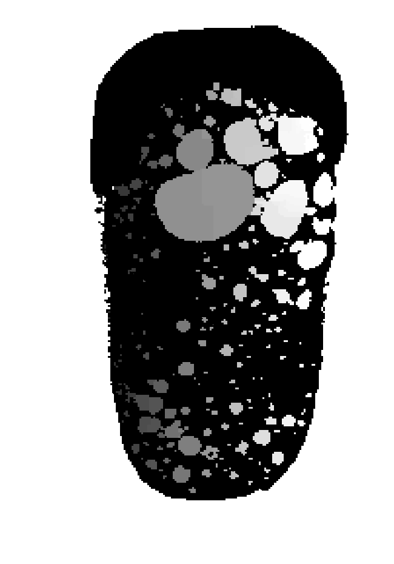

## Description

The watershed is an algorithm used for segmentation, that is, for separating different objects in an image.

> 'The basic idea consists of considering the input image as topographic surface and placing a water source in each regional minimum of its relief.
Next the entire relief is flooded from the sources and dams are placed where the different water sources meet.
All points in the surface at a given minimum constitute the catchment basin associated with that minimum.
The watersheds are the zones dividing adjacent catchment basins.' [Watershed Explained](https://imagej.net/Classic_Watershed)

[Watershed Package](https://scikit-image.org/docs/dev/auto_examples/segmentation/plot_watershed.html)

Example for watershed use. First a segmentation (maybe negated) must be used on the object.

## Parameters

The following list details which parameters are used by the filter.

### Minimum distance

Minimum grayscale value to start flooding from.

Default Value 5, Minimum Value 1
