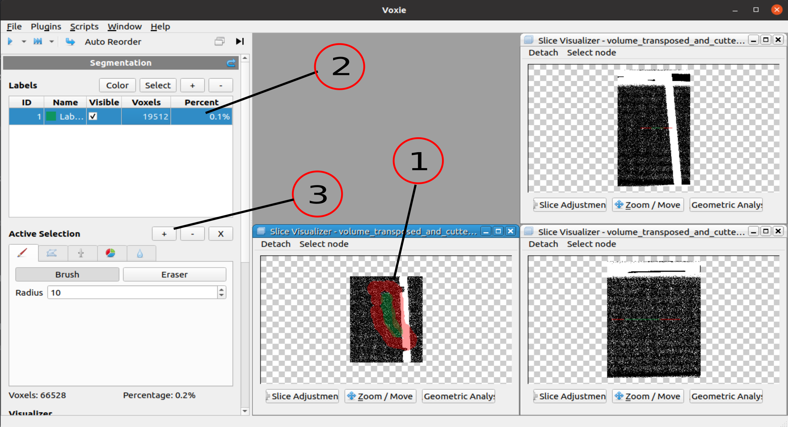

## General Information

- Takes a pre-condition a existing voxel selection, which it then assigns to a selected LabelID

## How to

1. Select voxels that shall be added to a certain labelID (Any selection tool/ step is suitable)
2. Select a label to which the voxels shall be added 
3. Click on the + (Assignment step button) above the StepTab widget

- **Hint:** When no Label is selected, a new label is created on default and the selected voxels are assigned to this label. 

## Algorithm

- Iterates all voxels of the labelVolume and sets the voxel value of the voxels that are selected to the chosen LabelID

## Properties
- Label Id: Segmentation Label ID to which the existing voxel selection shall be added 
