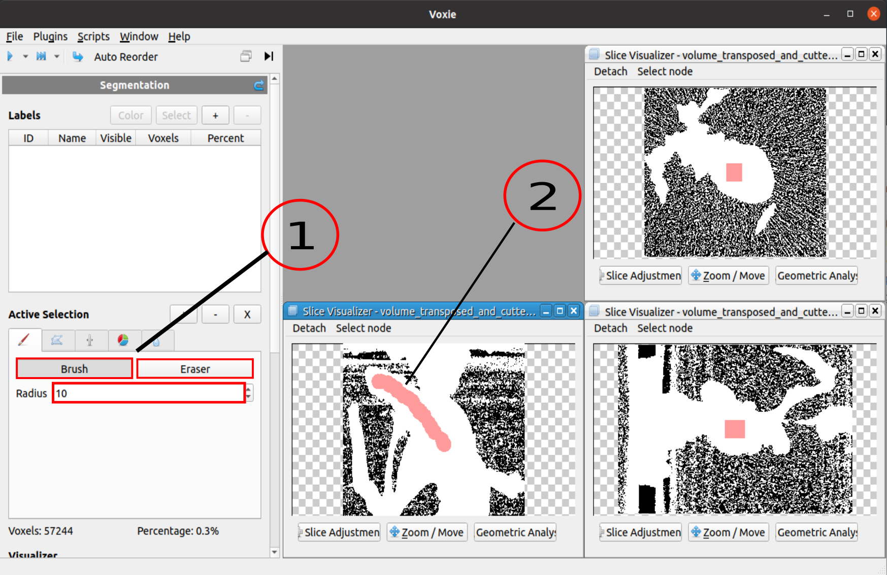

## General Information

- Offers a brush/eraser tool which enables the user to select/erase multiple voxel via moving the brush/eraser over the slice visualizers.

- The functionality is based on region growing 

- For each SliceVisualizer a separate BrushSelectionStep is hold by the StepManager
  
- A single BrushSelectionStep is just responsible for a singe plane. 
  - If the plane changes a new step needs to be creates & the old has to be appended to the StepList

- The eraser is just the inverse of the selection -> same region growing algorithm

- The BrushSelectionStep takes as an input 
  - the **center of the Brush** in global coordinates [m]
  - the coresponding **radius** [m]
  - labelVolume
  - plane properties

- The code is in the step itself and in the **IndexCalculator** class that servs as a base class for the Brush- & [Lasso Selection](voxie:///help/prototype/de.uni_stuttgart.Voxie.SegmentationStep.LassoSelectionStep) steps

- As an initial growing point for the region, the voxel closest to the center is taken (if it is inside of the volume)

## How to

1. Select, if you want to select pixels (Brush) or deselect pixels (Eraser) and choose your desired Brush-Radius. 
2. Select in the SliceVisualizer the areas that you want to select/ deselect (click and drag). 

- **Hint:** A large radius as well as a low zoom level can lead to high computation times to find the pixels inside the brush 



## Algorithm

Pseudo-code of **main algorithm**: 

```

def brushSelection(center_voxel)
    Set visitedVoxels; 
    List voxelsToVisitNext = {center_voxel};
    List foundVoxels;  
    while visitedVoxels(!voxelsToVisitNext.isEmpty())
        voxel = voxelsToVisitNext.popFirst()
        if (intersectsWithPlane(voxel) and InRadius(voxel))
            foundVoxels.append(voxel)
            addNeihboursToVisitNext(visitedVoxels, voxelsToVisitNext, voxel)
        fi;
    od; 

    return foundVoxels
```

Pseudo-code of **intersectsWithPlane**: 

```
def intersectsWithPlane(voxel)
        if ((at least one voxel corner is on the other side of the plane than the other ones)
            or (the distance of one corner to the plane is lower than a fixed threshold))
            return True;  
        else 
            return False; 
```

Pseudo-code of **addNeihboursToVisitNext**: 

```
def addNeihboursToVisitNext(visitedVoxels, voxelsToVisitNext, voxel)
    if (!visitedVoxels.contains(voxel) and voxelInVolume(voxel))
        voxelsToVisitNext.append(voxel)
    fi;
```

## Properties
- **BrushSelectCentersWithRadius**: List of tuples with radius and 3D brush position for each brush application
- **BrushEraseCentersWithRadius**: List of tuples with radius and 3D brush position for each eraser application
- **VolumeOrientation**: Volume rotation in global coordinates used in this brush step
- **VolumeOrigin**: Volume translation in global coordinates used in this brush step
- **VoxelSize**: Voxel sizes used in this brush step
- **PlaneOrientation**: Plane rotation of brush with respect to the VolumeOrientation
- **PlaneOrigin**: Plane origin of brush with respect to the VolumeOrientation

Coordinate descriptions can also be found here: [Coordinate System Overview](voxie:///help/topic/coordinate-systems)
