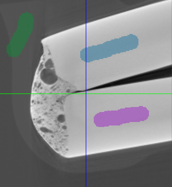
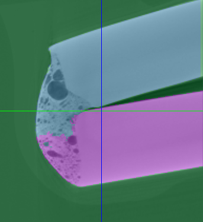

## General Information

The watershed is an algorithm used to separate different objects in an image.

Selected labels are used as seed points and they also determine the amount of regions that are outputted.
Unselected labels will be overwritten and cleared because the watershed algorithm operates on the whole volume.

## How to

1. Select the labels in the label table which should be chosen as seed points. This can be anything from small brush dots to more complex regions. (Use Ctrl or Shift to select multiple labels)
2. Choose an appropriate Sigma value
3. Run the watershed segmentation

## Algorithm

During the execution of the algorithm the different regions grow along the least gradient magnitude.
In each iteration the current neighbours are added to a priority queue and then the voxel with the overall lowest gradient is chosen.
This voxel is then assigned a label based on its neighbours.

## Parameters

### Sigma

The sigma value used in the gaussian blur.

Default Value 5, Minimum Value 1

### Execution kind

Determines if the sequential or parallel implementation is used

## Parallel Implementation

The parallel implementation is based on the paper "Parallel Marker-Based Image Segmentation with Watershed Transformation" by Alina N. Moga <doi:10.1007/3-540-49164-3_21>.

The algorithm works by creating minimum spanning trees for each region on different threads using the Boruvka algorithm.
After that those regions are merged pairwise.

### Current state

A relatively fast implementation for the minimum spanning tree creation has been written which is faster than the sequential watershed.
However, it produces often worse results than the sequential implementation.
The quality of the results can be increased by using greater and more extensive regions as seed points.

At the moment the second part of the algorithm, where regions are merged, does not exist yet as well as the handling of region borders.

