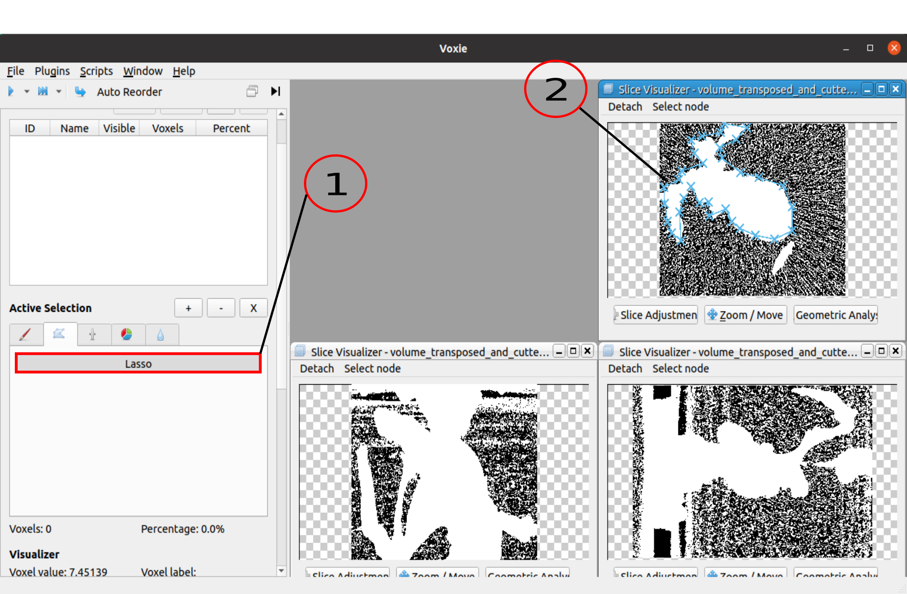
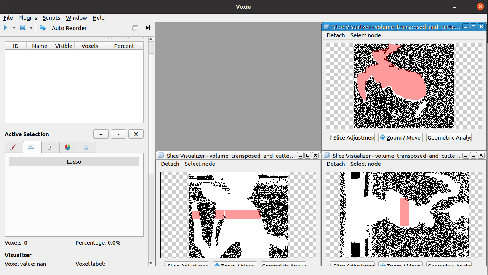

## General Information

- Offers a lasso tool which enables the user to select multiple voxel by drawing a simple polygon over the slice visualizers.

- The functionality is based on region growing 

- For each SliceVisualizer a separate LassoSelectionStep is hold by the StepManager
  
- A single LassoSelectionStep is just responsible for a single Polygon

- The LassoSelectionStep takes as an input 
  - List of Nodes that span the simple Polygon (in global coordinates [m])
  - labelVolume
  - plane properties

- The code is in the step itself and in the **IndexCalculator** class that servs as a base class for the Lasso- & [Brush Selection](voxie:///help/prototype/de.uni_stuttgart.Voxie.SegmentationStep.BrushSelectionStep) steps. 

- As an initial growing point for the region, voxels that form a circle around the first node of the polygon are choosen. (The voxel closest to the node can be outside of the polygon)

## How to

1. Click on the Lasso-Button
2. Click inside the SliceVisualizers (Each click is a node of the Polygon, between consecutive nodes a line will be drawn). Close the polygon
  

- **Hint:** A large polygon as well as a low zoom level can lead to high computation times to find the pixels inside the simple polygon 



After Closing: 


## Algorithm

Pseudo-code of **main algorithm**: 

```
def brushSelection(List nodes, int radius)
    Set visitedVoxels; 
    List voxelsToVisitNext = midPointCircleAlgorithm(nodes.first(), radius);
    List foundVoxels;  
    while visitedVoxels(!voxelsToVisitNext.isEmpty())
        voxel = voxelsToVisitNext.popFirst();
        if (intersectsWithPlane(voxel) and InPolygon(voxel, nodes)
            foundVoxels.append(voxel);
            addNeihboursToVisitNext(visitedVoxels, voxelsToVisitNext, voxel);
        fi;
    od; 

    return foundVoxels
```

Pseudo-code of **InPolygon** (based on **ray casting algorithm**): 
```
def InPolygon(voxel, List nodes)
    -> performs ray casting algorithm to check if voxel is inside of the polygon that is spanned by the nodes
    return True/False
```

Pseudo-code of **midPointCircleAlgorithm** (based on **midpoint circle algorithm**)
```
midPointCircleAlgorithm(middlePoint, int radius)
    -> performs midpoint circle algorithm to get the voxel on the circle around the middle point.
    return voxelsOnCircle 
```

Pseudo-code of **intersectsWithPlane** in [Brush Selection](voxie:///help/prototype/de.uni_stuttgart.Voxie.SegmentationStep.BrushSelectionStep). 


Pseudo-code of **addNeighboursToVisitNext** in [Brush Selection](voxie:///help/prototype/de.uni_stuttgart.Voxie.SegmentationStep.BrushSelectionStep). 

## Properties
- **PolygonNodes**: List of polygon border nodes in 3D global coordinates
- **VolumeOrientation**: Volume rotation in global coordinates used in this lasso step
- **VolumeOrigin**: Volume translation in global coordinates used in this lasso step
- **VoxelSize**: Voxel sizes used in this lasso step
- **PlaneOrientation**: Plane rotation of polygon with respect to the VolumeOrientation
- **PlaneOrigin**: Plane origin of polygon with respect to the VolumeOrientation

Coordinate descriptions can also be found here: [Coordinate System Overview](voxie:///help/topic/coordinate-systems)
