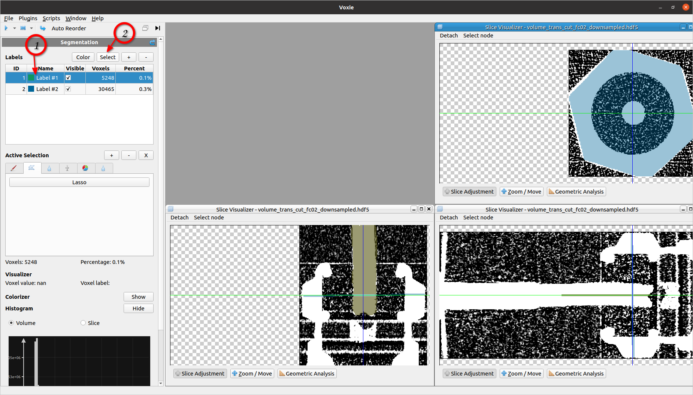

## General Information
SegmentationStep for selecting voxels from one or multiple given labelIDs (pre-condition). Iterates the
labelVolume to checkthe labelIds at each voxel. At voxels where the ID is met, the
selection bit is set.

## How to

1. Highlight labelIDs in the Segmentation label table view (Left click/ Ctrl+Left Click)
2. Press the select label button

## Algorithm

- Iterates all voxels of the labelVolume and sets the selection bit of these voxels matching the chosen LabelIDs

## Properties
- LabelIds: Int list of Segmentation Label IDs which shall be selected
