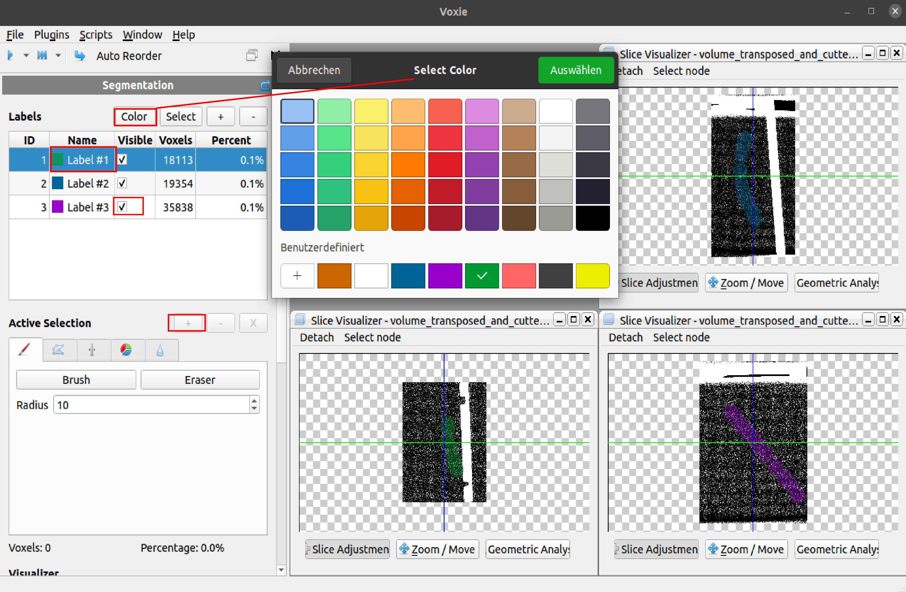

## General Information 

- All functionality which modifies the TableData (labelTable) is a MetaStep. It only does modifications like color or name changes, but no operations on the voxel data.
- The step handles **four different tasks** 
   1. Change name of a Label 
   2. Change color of a Label 
   3. Change visibility of a Label (e. g. if visibility is turned of, the label is not displayed with its color in the visualizers)
   4. Add new Label (labelTable entry with no assigned voxels)  
  
## How to

- In the picture below all MetaStep related buttons boxes are highlighted. 
- Some functionalities can be directly accesssed by double clicks in the table. 
- Some are accessed through the toolbar above in combination with the selection of a Label
- The '+' does create a new emtpy default Label  

## Algorithm

- For each change a separate MetaStep is created. 
- A MetaStep does always contain (properties)
  - **LabelID** (where change is applied/ created)
  - **ModificationKind** (Enum that indicates which of the four tasks is applied)
  - **One property entry** (LabelName/ LabelVisibility/ LabelColor) that corresponds to the **ModificationKind** and contains the changed/ new information

## Properties
- **Label Id**: Segmentation label id on which this MetaStep modification belongs to
- **ModificationKind**: Type of meta operation this step performs. One of the following enum values:
   - **AddLabel**: Operation of adding a new label in the segmentation (adds new label)
   - **VisibleChange**: Change operation of the label visibility (modification on an existing label)
   - **ColorChange**: Change operation of label color (modification on an existing label)
   - **NameChange**: Change operation of label name (modification on an existing label)
   - **DescriptionChange**: Change operation of label description (modification on an existing label)
- **Visibility**: Label visibility boolean value used when modification kind is VisibleChange 
- **Color**: Label color value used when modification kind is ColorChange 
- **Name**: Label name value used when modification kind is NameChange
- **Description**: Label description value used when modification kind is DescriptionChange
