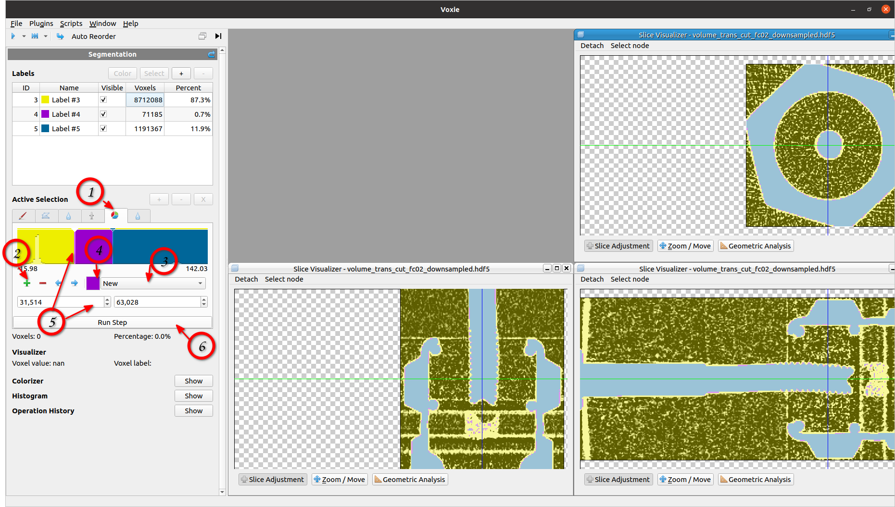

## General Information
SegmentationStep which takes a given threshold to label mapping and assigns
the voxels to threshold ranges. Iterates trough the input volume and
labelVolume checking the input if threshold ranges are met, if true sets the
labelVolume voxel to the given label ID for that range.

## How to

1. Select the MultiThreshold Tab in the Active Selection
2. Add as many new label ranges as you want to assign (by default everything between -inf to +inf is assigned to one label)
3. Select the label you want to assign to the currently selected data range. Choose between:
    - Existing labels from label table
    - Create new label for that data range with "New"
    - Ignore this data range in the assignment with "Ignore"
4. Select the color for that label (only if it is a new label)
5. During the whole process you can adjust the data range borders via drag&drop of sliders or with the scroll boxes
6. Execute the step which produces this assignment

## Algorithm
Iterates the input volume and labelVolume checking the input in which threshold range it belongs
Assigns the label ID for the data range where the voxel value matches to the label volume voxel.

## Properties
- ThresholdList: List of touples between each data range left border value and the assigned label ID
- Volume: Reference to the input volume on which the multi thresholding operation is performed
