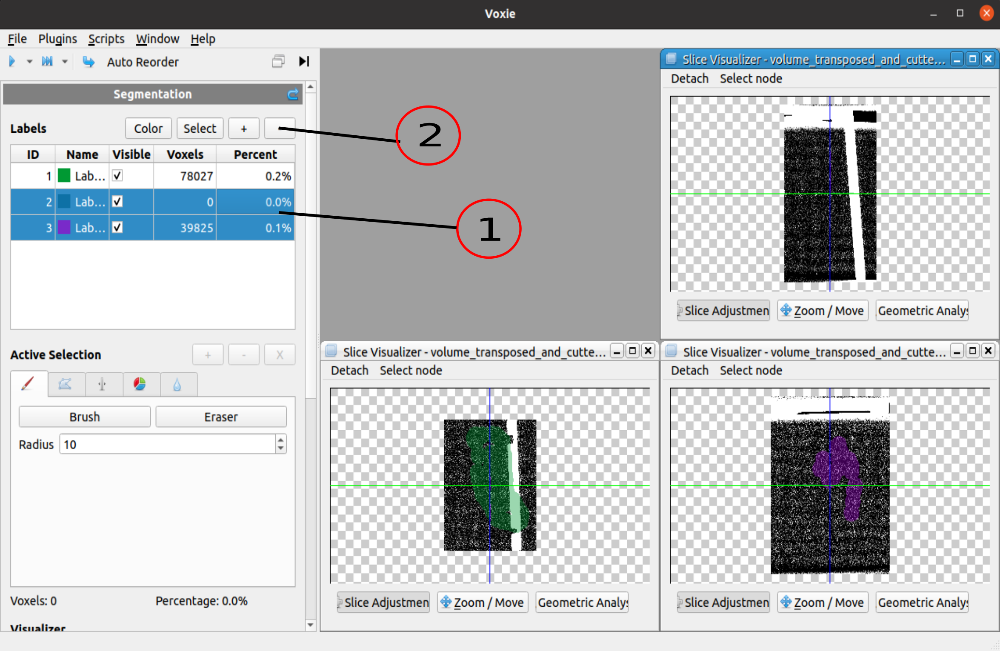

## General Information 

- Removes the passed/ selected LabelIDs from the labelVolume and the labelTable.

## How to

1. Select the labels that shall be removed (Left click/ Ctrl+Left Click)
2. Click on the - (remove Label Button) in the upper right corner 

## Algorithm

- Iterates all Voxels of the labelVolume and sets the labels that shall be removed to zero.
- Removes afterwards the corresponding labelTable entries  

## Properties
- Label Ids: List of segmentation label ids which are removed when executing this step
