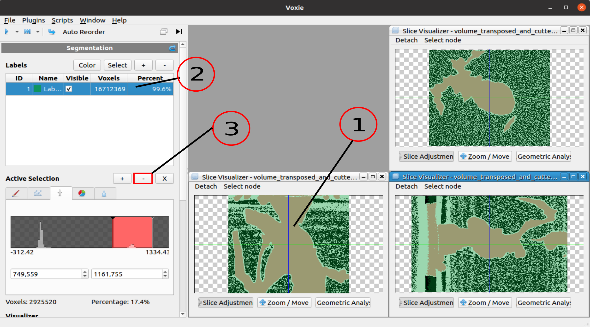

## General Information 

- Contrary step of an AssignmentStep. Takes as pre-condition an existing voxel selection, which it then subtracts from a selected label id.

## How to

1. Select voxels of a labeled region that shall be removed from the region (Any selection tool/ step is suitable)
2. Select the label from which the selected voxels shall be subtracted (Left click/ Ctrl+Left Click)(Works just with a single label) 
3. Click on the - (subtract step button) above the StepTab widget

## Algorithm

- Iterates all voxels of the labelVolume and sets the voxel value of the selected Label that are in the selection state to zero.

## Properties
- Label Id: Segmentation Label ID from which the existing voxel selection shall be subtracted 
