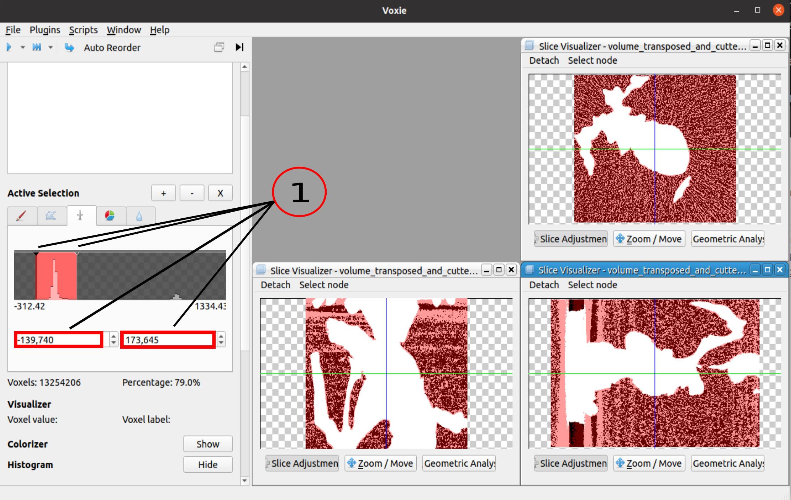

## General Information 

- Reads the input volume and based on two user given threshold boundaries it selects multiple voxel which values are inside this threshold range.

## How to

**Hint:** The voxels between the thresholds are selected each time a threshold is changed and the previous selection is overwritten. 

There are **two ways** to modify the thresholds:

1. Set the thresholds byte: 
   * The thresholds can me moved in the ThresholdWidget by clicking and dragging or
   * by changing the values in the spin boxes under the ThresholdWidget.  

## Algorithm

- Iterates all voxels of the input volume and sets the selection bit of the corresponding labelVolume voxel, if the voxel value of the input volume voxel is between the thresholds.

## Properties
- Lower Threshold: Lower voxel value boundary of the threshold range
- Upper Threshold: Upper voxel value boundary of the threshold range
- Volume: Reference to the input volume on which the thresholding operation is performed
