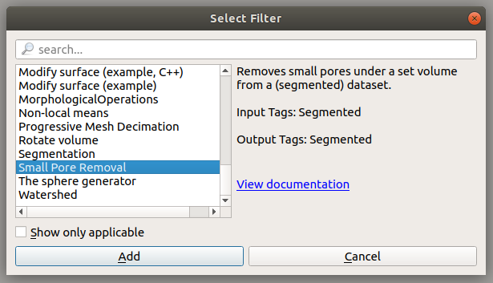
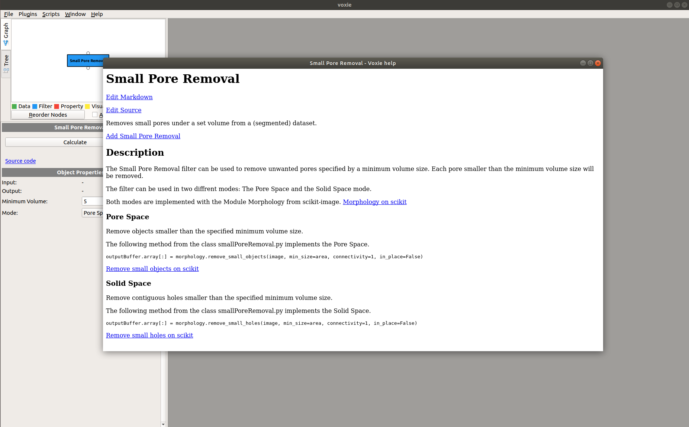

# Voxie - Integrated Documentation

## How to Use
The integrated system works with the QT WebEngine to enable an independent view of the documentation for each object. The main goal of this system is to create a simple to use and always updated documentation. The following criteria were realized with this system, to ensure the goals:
* Making sure the documentation will be used
* The system removed the barriers to updating the documentation

### Using the documentation
Instead of relying on a classic manual, the documentation is integrated in the executed program. Each object like filters, visualizer or property objects have an "View Documentation" link, which opens, on a button press, the respective documentationpage inside the program as seperated window, resulting in a high user friendliness.

 


### Updating the documentation
Besides the user friendliness the system ensures a simple update method. The "Edit Markdown" link, at the beginning of each documentation window can be used to open the specific markdownfile. Only a up-to-date and complete documentation can be useful, so dont hesitate to improve the current version with valuable informations.


### Mathematical formulas
The documentation can include mathematical formulas using the gitlab markdown
math syntax: <https://docs.gitlab.com/ce/user/markdown.html#math>

For example you can use ```$`1 + \frac{1}{2}`$``` for inline math: $`1 + \frac{1}{2}`$ or
````
```math
1 + \frac{1}{2}
```
````
for block (display) math:
```math
1 + \frac{1}{2}
```
