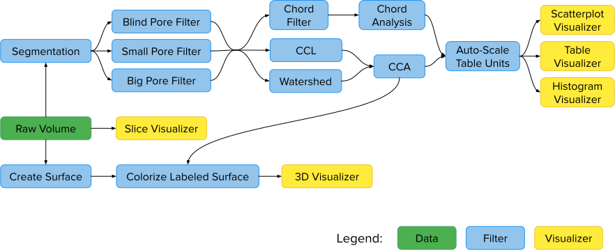

# Using Voxie for Pore Analysis

## Overview

Voxie's pore analysis functionality was developed as part of an "Entwicklungsprojekt" at the University of Stuttgart in 2019/2020.
The goal of the project has to extend Voxie with features to aid in the analysis of porous volume datasets.
The distinguishing feature of such datasets is the presence of a large number of connected or disconnected spaces of lower density ("pores") embedded in solid material.
In the context of pore analysis, metrics such as the quantity, distribution, shape, size and orientation of these pores are of main interest.
The characteristics of the solid material itself are of secondary importance.

To this end, Voxie provides functionality to support the user through all stages of the pore analysis workflow:
* **Preprocess** volume data via a variety of filters, followed by [segmenting] and [labeling] the porous volume
* **Analyze** pores within labeled volumes via the [Connected Component Analysis] process, collecting metrics for each pore and storing them in a table
* **Visualize** the results of a pore analysis by aggregating the collected metrics as a [Histogram] or [Scatter Plot], or adding metric-dependent color mapping to a [3D Visualization] of the volume.

[segmenting]: voxie:///help/prototype/de.uni_stuttgart.Voxie.Filter.Segmentation
[labeling]: voxie:///help/prototype/de.uni_stuttgart.Voxie.CCL
[Connected Component Analysis]: voxie:///help/prototype/de.uni_stuttgart.Voxie.CCA
[Histogram]: voxie:///help/prototype/de.uni_stuttgart.Voxie.HistogramVisualizer
[Scatter Plot]: voxie:///help/prototype/de.uni_stuttgart.Voxie.ScatterPlotVisualizer
[3D Visualization]: voxie:///help/prototype/de.uni_stuttgart.Voxie.Visualizer3D

## Pore analysis data flow

The following filters and visualizers are provided as part of Voxie's pore analysis featureset:

