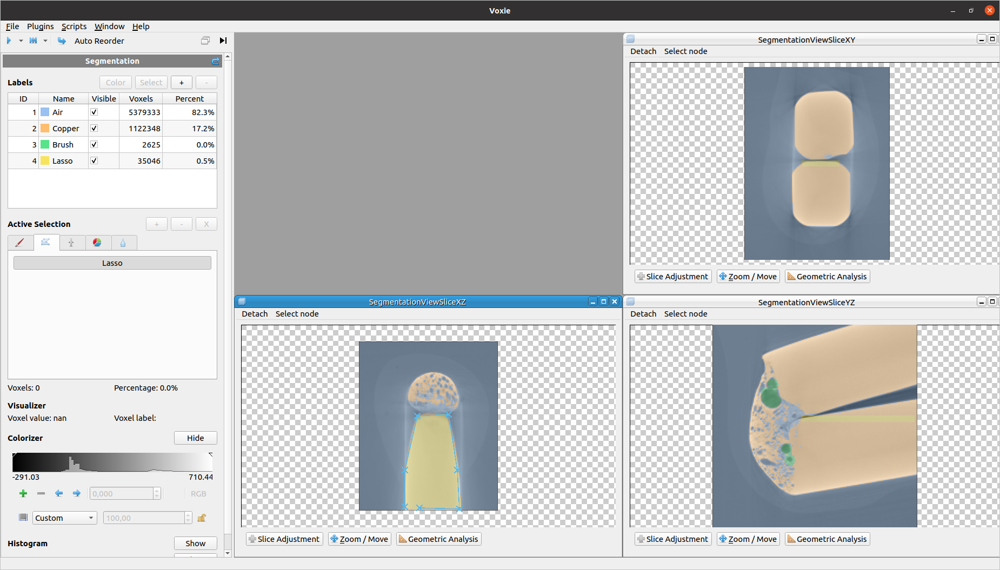

# Segmentation
Segmentation is a voxie plugin which provides several functionalities to perform segmentation on volume data.

- [Segmentation Filter](voxie:///help/prototype/de.uni_stuttgart.Voxie.Filter.SegmentationStep)
- [Threshold Selection](voxie:///help/prototype/de.uni_stuttgart.Voxie.SegmentationStep.ThresholdSelectionStep)
- [Multi-Theshold Segmentation](voxie:///help/prototype/de.uni_stuttgart.Voxie.SegmentationStep.MultiThresholdStep)
- [Manual Selection](voxie:///help/prototype/de.uni_stuttgart.Voxie.SegmentationStep.ManualSelectionStep)
- [Brush Selection](voxie:///help/prototype/de.uni_stuttgart.Voxie.SegmentationStep.BrushSelectionStep)
- [Lasso Selection](voxie:///help/prototype/de.uni_stuttgart.Voxie.SegmentationStep.LassoSelectionStep)
- [Remove Label](voxie:///help/prototype/de.uni_stuttgart.Voxie.SegmentationStep.RemoveLabelStep)
- [Meta Step](voxie:///help/prototype/de.uni_stuttgart.Voxie.SegmentationStep.MetaStep)
- [Assignment Step](voxie:///help/prototype/de.uni_stuttgart.Voxie.SegmentationStep.AssignmentStep)
- [Subtract Step](voxie:///help/prototype/de.uni_stuttgart.Voxie.SegmentationStep.SubtractStep)
- [Watershed Step](voxie:///help/prototype/de.uni_stuttgart.Voxie.SegmentationStep.ExtSegmentationStepWatershed)

## Basics

The segmentation can be opened in voxie as any other filter, but provides a custom [GUI](#gui) when entered, which then allows the user to perform advanced segmentation. The general idea is to have a [step concept](#step-concept) where each step performs a single operation on to the provided volume .
The steps can be combined in arbitrary order and are tracked in a list which is stored as property which allows the re-computation of the graph if wished. 
Additionally new data structures got introduced which are used to handle label data in a efficient way and combining it with volume data inside a container. More on this topic is written in section [Data structure](#data-structure).
Segmentation uses threading to execute the steps in parallel to at any time allow the user access and interaction with the GUI. The detailed description how threading is handled can be found in [Threading](#threading).

## Step concept
Each segmentation functionality is in the segmentation concept a step. A step is a class derived from the abstract base class SegmentationStep which is, like all the steps too, a voxie node. The steps also have a specific node kind which is *SegmentationStep*. 
Like any voxie node class all the steps have properties which are defined inside specific node prototype json files and are used to store step specific data. This allows the data to be persistent also when the voxie project is saved and reloaded.

**Type of steps**:
- [Meta Step](voxie:///help/prototype/de.uni_stuttgart.Voxie.SegmentationStep.MetaStep) \
  All functionality which modifies the TableData is a MetaStep. It only does modifications like color or name changes, but no operations on the voxel data.
- [Assignment Step](voxie:///help/prototype/de.uni_stuttgart.Voxie.SegmentationStep.AssignmentStep) \
  Takes a pre-condition a existing voxel selection, which it then assigns to a selected label id.
- [Subtract Step](voxie:///help/prototype/de.uni_stuttgart.Voxie.SegmentationStep.SubtractStep) \
    Contrary step of an AssignmentStep. Takes a pre-condition a existing voxel selection, which it then subtracts from a selected label id.

- [Remove Label](voxie:///help/prototype/de.uni_stuttgart.Voxie.SegmentationStep.RemoveLabelStep) \
  Removes passed LabelIDs from the labelVolume.

- [Manual Selection](voxie:///help/prototype/de.uni_stuttgart.Voxie.SegmentationStep.ManualSelectionStep) \
  Sets the selection for all voxel that belong to a given label id.

- [Threshold Selection](voxie:///help/prototype/de.uni_stuttgart.Voxie.SegmentationStep.ThresholdSelectionStep) \
    Reads the input volume and based on two user given threshold boundaries it selects multiple voxel which values are inside this threshold range.
- [Multi-Threshold Segmentation](voxie:///help/prototype/de.uni_stuttgart.Voxie.SegmentationStep.MultiThresholdStep) \
  Reads the input volume and based on multiple user given thresholds it directly assigns multiple voxel to the label id which the user assign with the matching threshold range.

- [Brush Selection](voxie:///help/prototype/de.uni_stuttgart.Voxie.SegmentationStep.BrushSelectionStep) \
  Offers a brush/eraser tool which enables the user to select/erase multiple voxel via moving the brush/eraser over the slice visualizers. 
  
- [Lasso Selection](voxie:///help/prototype/de.uni_stuttgart.Voxie.SegmentationStep.LassoSelectionStep)
    Offers a lasso tool which enables the user to select multiple voxel by drawing a polygon over the slice visualizers.

- [Watershed Step](voxie:///help/prototype/de.uni_stuttgart.Voxie.SegmentationStep.ExtSegmentationStepWatershed)
  Grows selected Labels after the watershed principle. Labels that are not selected are overwritten by the evolving selected Labels. 

**Step List**:\
 The overall segmentation filter contains a step list as property which holds the execution order and parameters for the segmentation steps performed. Through the list it is also later possible to execute the computation graph again.\
 **TODO**:
 All the selection steps are not directly appended to the label list, as their execution can be overridden by newer selection steps or the user wants to erase/reset some selection parts. Threshold selection and Manual selection steps also implicitly override the currently active selection. Brush and lasso selection do **not** override the active selection but add their new selection to the existing one.
Only when a assignment step is triggered the list of selection steps is sequentially written to the general step list.

## Data structure
The storage concept of the segmentation has the following elements:

  - **ContainerNode:** \
  The ContainerNode is a general data wrapper which consists of arbitrary other Voxie data nodes and combines them into one unit.
  For segmentation the compound data which is the storage of the node holds two data items:

  - **TableData (LabelTable):** \
  General voxie table data object for label information including: Label Ids, Label Name, Label Color, Label Statistics(Voxel Count, Voxel Percentage), Label Description

  - **VolumeDataVoxel (LabelVolume)**: \
  Volume data element which is the same size as the input voxel data but its data are the label IDs for each voxel. It can be seen as a mapping of label information to the given input volume, where each input volume voxel corresponds to the label volume voxel at the same position. Each voxel of the input volume is uniquely assigned to exactly one label ID by setting the voxel value. Additionally the MSB of each voxel is used to perform selections on the voxel data. When a voxel shall be selected the upper bit is set to 1 which then marks this specific voxel as selected, setting it to 0 deselects the voxel at that position again. The LabelVolume uses the type defined via SegmentationType which can be adjusted as wished.

**SegmentationType**: \
As data type for our voxel volume we use the SegmentationType which is a typedef found in SegmentationUtils.hpp. 
The type size is a tradeoff between amount of possible labels and storage requirements for the label volume. E.g. Uint8 type would allow for a total of 127 labels (IDs: 1 to 127) because the upper bit is the selection bit as mentioned above and 0 is used as no label assignment. For this example it would be using a storage of *8bit * Dimensions(LxWxH)* of the input volume dimensions.

## GUI
The segmentation GUI is a custom QWidget which gives a overview of the current segmentation and handy access to the segmentation tools and visualisations. It also includes 3 SliceVisualizers for the XY, YZ, XZ planes which are spawned inside the voxie window pane.

It contains the following elements:
- **Label Table List View**:\
  List View of the data inside the LabelTable element showing all its data items in ordered form.
  
- **Active Selection**:\
  TabView where each tab is a specific Segmentation Function (e.g. ThresholdSelection, Brush, Lasso, Multi-Threshold-Segmentation).
  Additionally Buttons to  assign(+) and subtract (-) from a label or delete (X), to delete the active selection. Also the active selection statistics including the number and percentage of selected voxels.

- **Visualizers**: \
   For the selected SliceVisualizer the label id and volume for the hovered mouse position are displayed.

- **Colorizer**: \
  Foldable colorizer for the segmentation which controls the colorizer of all 3 SliceVisualizers simultaneously.

- **Histogram**: \
  Foldable histogram for segmentation which can either display volume or slice histogram information given the radio button selection.
  
- **Operation History**: \
  History of executed segmentation steps containing information about the order and type of all the segmentation steps that got executed and their specific values.

The segmentation GUI is dynamically loaded inside the standard voxie sidepanel when the segmentation is entered. This is achieved by assigning the QWidget to the SegmentationFilter object customUi, which then is recognized in the side panel class. Entering the segmentation can be done via *Double-Click on the SegmentationFilter* inside the GraphWidget. The custom UI then is the only displayed element in the sidepanel, as the usual GraphWidget and voxie toolbars are hidden during the display of the custom UI.

## Threading
Threading of the segmentation functionality allows asynchronous execution while keeping the GUI responsive. For segmentation the global QThreadPool is used to sequentially execute a queue of SegementationSteps. 
These steps are collected in a list to keep their execution order.
Additionally selection steps that only select voxels by changing the highest bit (MSB) are kept in a separate queue.
They are not assigned to the final step list until an Assignment or Subtract step is performed.
