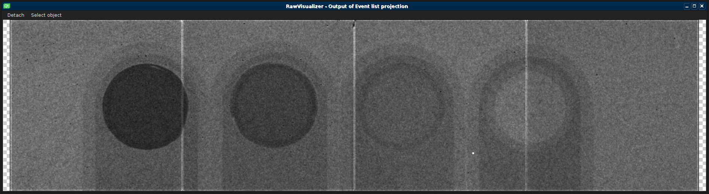

# Using Voxie for processing Timepix3 output

## Overview

Voxie's tomography event stream processing functionality was developed as part
of a "Forschungsprojekt" at the University of Stuttgart in 2020/2021.

The event stream functionality aims to extend Voxie with features to process raw
tomography scans recorded by an array of *Timepix3* detectors. These scans are
stored in the `.t3r` file format, and can range from hundreds of megabytes to
a terabyte in size.

Due to the scale of these files, all *Event List* objects in Voxie are fully
lazy-loaded, reading data from the hard disk as needed, without requiring the
full dataset to be stored in RAM. As a result, there is virtually no limit on
the size or quantity of datasets that can be processed by Voxie's *Timepix3*
processing pipeline.

## Pipeline components

Voxie provides a full data processing pipeline raw *Timepix3* event streams.

The pipeline's structure within Voxie's object graph is somewhat fixed, starting
with the import of a [`.timepixraw.json`
file](voxie:///help/topic/file-formats/timepixraw), followed by an [Event List
Clustering filter], which feeds into an [Event list Projection filter], the
result of which can then be displayed by a [Raw Visualizer].

[Event List Clustering filter]: voxie:///help/prototype/de.uni_stuttgart.Voxie.Filter.EventListClustering
[Event list Projection filter]: voxie:///help/prototype/de.uni_stuttgart.Voxie.Filter.EventListProjection
[Raw Visualizer]: voxie:///help/prototype/de.uni_stuttgart.Voxie.Visualizer.TomographyRawData

All filters "complete" their output immediately, as all heavy-duty processing is
delayed until the data is accessed by the user, either via visualization of the
resulting raw data object, or by exporting the list of events or clusters to a
`.csv` file.

The importer and filter processes continue running in the background after being
run, providing their data on-demand via D-Bus and shared memory.

## File formats

In order to import and process multiple `.t3r` datasets with varying detector
parameters as one event list object in Voxie's graph, the [`.timepixraw.json`
data format](voxie:///help/topic/file-formats/timepixraw) is used to define the
location and parameters of each `.t3r` file comprising the full dataset.
